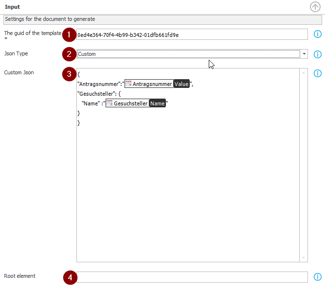
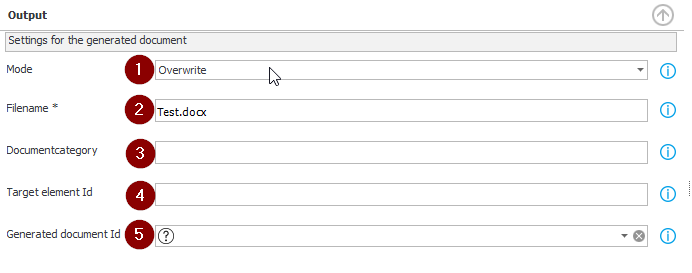
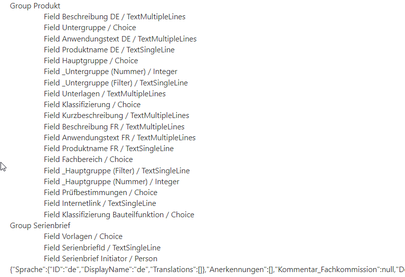

# Introduction 
SDK Add in for WEBCON BPS to generate Word documents based on Aspose Template engine
https://docs.aspose.com/words/net/linq-reporting-engine/

This extension brings a bunch of new functionalites when it is about word generation by using the [Aspose.Template Syntax](https://docs.aspose.com/words/net/template-syntax/)  

However, there is no update functionality available like the one used by the original WEBCON BPS Word generation action.

By using [Json as a datasource](https://docs.aspose.com/words/net/accessing-json-data/) we have more flexibility. 
- Simple Json
- One-To-Many relations
- **Richtext fields**
- Merging documents
  E.g. Main Document with CI/CD, content specific to a use case  

# Configuration

## Input

1. The id of the word template (a picker would be nice)
2. The type of json, can be **Standard** or **Custom**			
   **Standard:**
   Generates a json structure of the current element. Fields are keep together to her nearest group (group or tab). 
   It also generates the structures from itemlists, datatables or data row
   **Custom:**
   Use your custom json
3. Define your custom json. You can use field values the way you are used to.
4. Name of the root element
  Only needed, when the root of the json structure is an array of elements

## Output

1. Mode: you can choose between **Create** and **Overwrite**
   If Overrite is choosen, it will create a new version if a document with the same name exists.
2. Name of the generated document
3. Id/Name of the category, where the generated document should be saved
4. If empty the generated document will be attached to the current element. Otherwise it will be added to the defined element. 
   This gives the possibility to generate a document in a different workflow than to document is being attached to.
5. The field where the id of the generated document/attachment should be saved

# Json generation

Groups and fields and the resulting json structure is being logged during execution and can be viewed in admin mode.

The Aspose template syntax does not allow to use names with whitespace characters. So we replace whitespace by "_" and also remove "/".
E.g.
The fieldname **Produktname DE** becomes **Produktname_DE**. 
So it can be used in the template as <<[Produkt.Produktname_DE]>>

# License

You have to apply the license in the file [JsonReportingEngine](.\Nx.Aspose.Webcon\Core\JsonReportingEngine.cs)  order to run the action without watermark

